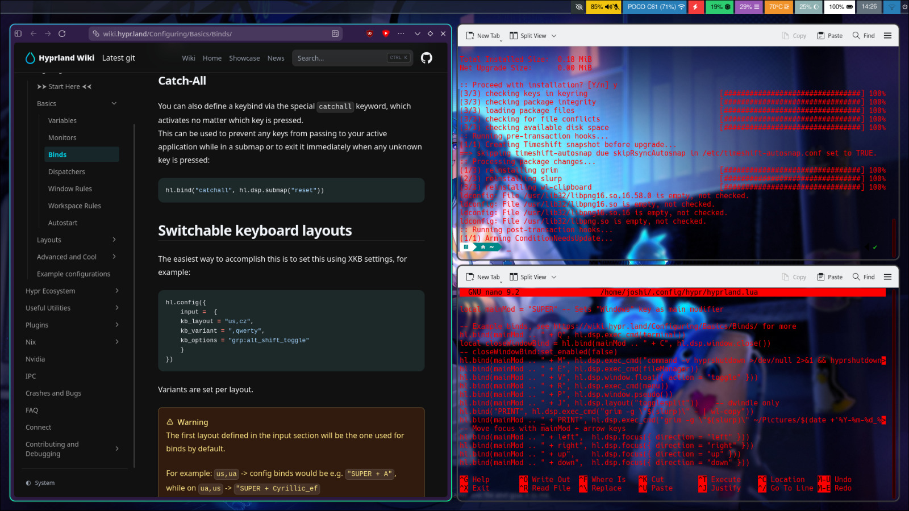
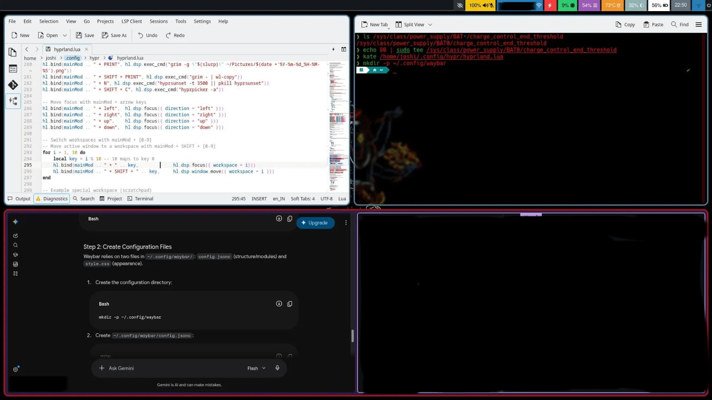
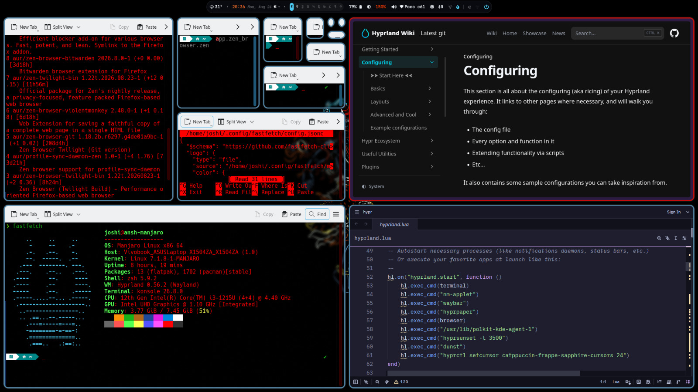
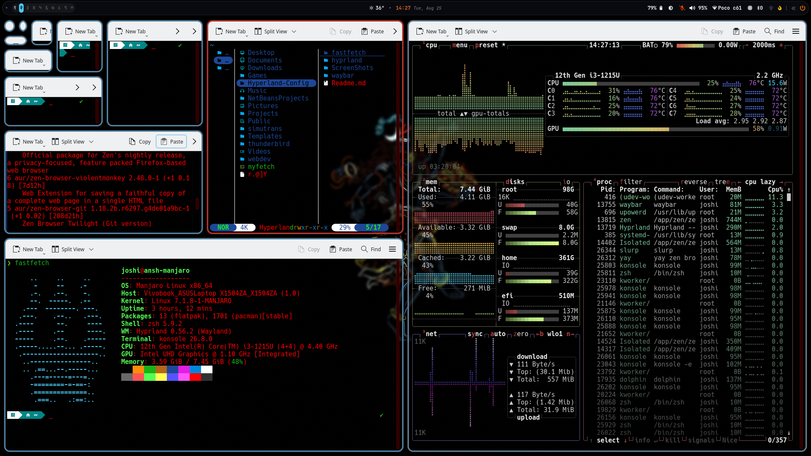
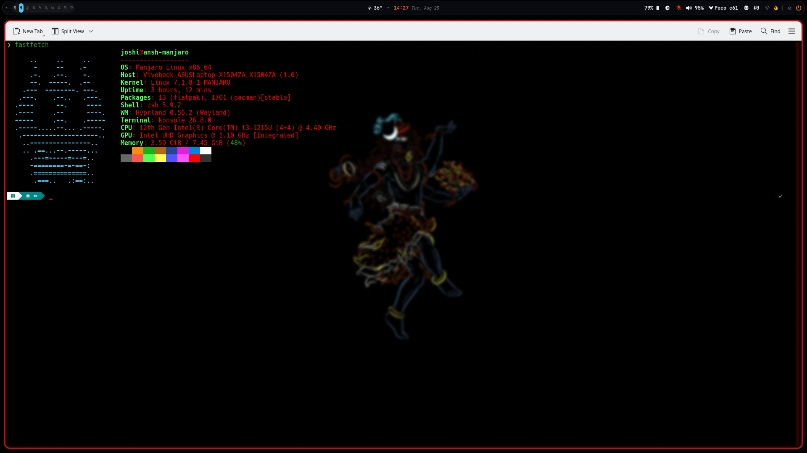

# ❄️ Hyprland & Waybar Dotfiles

A clean:   dark-themed Wayland desktop environment configuration powered by Hyprland (Lua config format) and Waybar.

---

#### Special Thanks to: 
Waybar Starting point: [HANCORE](https://github.com/HANCORE-linux/waybar-themes) <br>
Waybar Workspace Idea: [gdots](https://github.com/semi710/gdots) <br>
Desktop Wallpaper: [r/manikantv](https://www.reddit.com/r/Amoledbackgrounds/comments/xemdnx/mahadev1920x3413/)

## 🌟 Features

* **Lua-based Hyprland Setup:** Modular `hyprland.lua` configuration with custom spring/bezier animations and smooth workspace transitions.
* **Dynamic Waybar:** Centered status bar with real-time MPRIS music player metadata via `playerctl`:   weather updates via `wttrbar`:   and an interactive system tray drawer.
* **Minimalist Aesthetics:** Polished dark color scheme (`#080a0f` background) using JetBrainsMono Nerd Font and desaturated accent colors.
* **Built-in Desktop Tools:** Integrated shortcuts for regional screenshots (`grim` + `slurp`):   night light blue-filter toggle (`hyprsunset`):   color picker (`hyprpicker`):   and power controls (`wlogout`).

---

### Sreenshots
Where it started:


Just added wallpaper: (Some parts hidden due to privacy )


Here i changed the waybar config:


And these are current version:



## 📦 System Dependencies

Ensure the following packages are installed on your system before deploying:

| Category | Packages / Tools |
| :--- | :--- |
| **Desktop Core** | `hyprland`:   `waybar`:   `dunst`:   `polkit-kde-agent` |
| **Terminal & Apps** | `konsole`:   `dolphin`:   `fuzzel`:   `btop` |
| **Audio & Media** | `wireplumber`:   `pamixer`:   `playerctl` |
| **Power & Displays** | `brightnessctl`:   `wlogout`:   `wttrbar`:   `power-profiles-daemon` |
| **Screen Utilities** | `grim`:   `slurp`:   `wl-clipboard`:   `hyprsunset`:   `hyprpicker` |

---

## ⚙️ Quick Installation

### 1. Install Required Packages (Arch Linux / Arch-based)

```bash
sudo pacman -S hyprland waybar dunst konsole dolphin fuzzel btop \
               playerctl pamixer brightnessctl wlogout grim slurp \
               wl-clipboard network-manager-applet
```
### 2. Clone the Repository

git clone [https://github.com/Babayoboy/Hyprland-Config.git](https://github.com/Babayoboy/Hyprland-Config)

cd Hyperland.Config

#### Copy Waybar configuration
cp -r waybar ~/.config/

#### Copy Hyprland Lua configuration
mkdir -p ~/.config/hypr

cp hyprland.lua ~/.config/hypr/hyprland.lua

### 3. ⌨️ Keybindings Reference
```
Shortcut:  Action
Super + Q:  Open Konsole Terminal
Super + E:  Open File Manager (Dolphin)
Super + R:  Launch Application Launcher (Fuzzel)
Super + C:  Close Active Window
Super + V:  Toggle Window Floating Mode
Print:  Capture Region Screenshot to Clipboard
Super + Print:  Save Region Screenshot to ~/Pictures
Super + N:  Toggle Screen Blue-Light Filter (hyprsunset)
Super + Shift + C:  Color Picker (hyprpicker)
Super + 1-9:  Switch Workspace
Super + Shift + 1-9:  Move Window to Workspace
```
